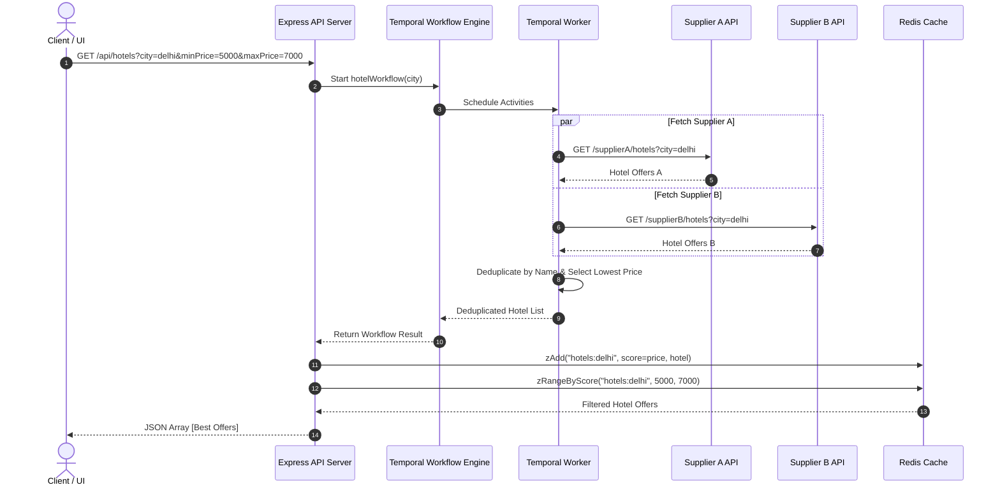

# Hotel Offer Orchestrator 🏨⚡

A distributed, fault-tolerant Hotel Offer Orchestrator built with **Node.js (TypeScript)**, **Express**, **Temporal.io**, **Redis**, and **Docker Compose**.


---

## 📌 Overview

The **Hotel Offer Orchestrator** aggregates hotel listings from multiple supplier mock APIs in parallel, deduplicates overlapping hotel offers by selecting the lowest rate per hotel name, stores the consolidated dataset in **Redis Sorted Sets**, and provides real-time price range filtering (`minPrice` / `maxPrice`).

It features an interactive **Landing Page UI Dashboard** to search hotels, test price filters, inject supplier downtime faults, and monitor real-time infrastructure telemetry.

---

## 🚀 Key Features

1. **Parallel Aggregation via Temporal.io**: Executes Supplier A and Supplier B activity fetches concurrently using Temporal workflows.
2. **Smart Price Deduplication**: Automatically deduplicates overlapping hotel listings by name (case-insensitive) and selects the supplier offering the cheapest rate.
3. **Resilient Fault Tolerance**: If a supplier is down or times out, the workflow gracefully logs the outage and serves the remaining available supplier listings without breaking user requests.
4. **Fast Price Range Queries with Redis**: Saves deduplicated results in Redis Sorted Sets (`zAdd` with `score = price`) and queries price ranges using `ZRANGEBYSCORE`.
5. **System Telemetry & Health Checks**: `/health` endpoint monitors Supplier A, Supplier B, Redis connection, and Temporal workflow engine.
6. **Interactive UI Landing Page**: Serves a modern dark glassmorphism web app for testing API requests, downloading the Postman collection, and viewing system state.
7. **1-Command Containerization**: Fully containerized using Docker & Docker Compose (`app`, `worker`, `supplier`, `temporal`, `redis`).

---

## 🏗️ Architecture & Workflow



---

## 🛠️ API Reference

### 1. Search Hotels (With Optional Price Range)
`GET /api/hotels`

#### Query Parameters:
| Parameter | Type | Required | Description |
| :--- | :--- | :--- | :--- |
| `city` | `string` | Yes | Target destination city (e.g. `delhi`, `mumbai`, `tokyo`) |
| `minPrice` | `number` | No | Minimum price filter (e.g. `5000`) |
| `maxPrice` | `number` | No | Maximum price filter (e.g. `7000`) |
| `simulatedDown` | `string` | No | Simulate downtime for testing (`supplierA` or `supplierB`) |

#### Example Response:
```json
[
  {
    "name": "Holtin",
    "price": 5340,
    "supplier": "Supplier B",
    "commissionPct": 20
  },
  {
    "name": "Radison",
    "price": 5900,
    "supplier": "Supplier A",
    "commissionPct": 13
  },
  {
    "name": "ITC Maurya",
    "price": 6800,
    "supplier": "Supplier B",
    "commissionPct": 15
  }
]
```

---

### 2. System Health Check
`GET /health`

#### Example Response:
```json
{
  "status": "healthy",
  "timestamp": "2026-09-22T13:30:00.000Z",
  "suppliers": {
    "supplierA": "up",
    "supplierB": "up"
  },
  "infrastructure": {
    "redis": "connected",
    "temporal": "connected"
  }
}
```

---

## 🐳 Quick Start with Docker Compose

Ensure Docker Desktop is running, then execute:

```bash
# Build and start all 5 containers (App, Worker, Supplier, Temporal, Redis)
docker compose up --build
```

Access the application:
- **Landing Page & UI Dashboard**: [http://localhost:3000](http://localhost:3000)
- **API Endpoint**: [http://localhost:3000/api/hotels?city=delhi](http://localhost:3000/api/hotels?city=delhi)
- **Health Check**: [http://localhost:3000/health](http://localhost:3000/health)
- **Temporal Web UI**: [http://localhost:8233](http://localhost:8233)

---

## 💻 Local Development (Without Docker)

### Prerequisites:
- Node.js (v18+)
- Local Redis running on port `6379`
- Local Temporal Dev Server (`temporal server start-dev`)

### Installation & Run:

```bash
# 1. Install dependencies
npm install

# 2. Build TypeScript files
npm run build

# 3. Start Mock Suppliers (Terminal 1)
npm run supplier

# 4. Start Temporal Worker (Terminal 2)
npm run worker

# 5. Start API Server (Terminal 3)
npm run dev
```

---

## 🧪 Postman Collection

A complete Postman collection is included in the project:
- Location: `src/postman/Hotel_Offer_Orchestrator.postman_collection.json`
- Download link from UI: [http://localhost:3000/postman/Hotel_Offer_Orchestrator.postman_collection.json](http://localhost:3000/postman/Hotel_Offer_Orchestrator.postman_collection.json)

### Included Scenarios:
1. `GET /api/hotels?city=delhi` (Valid city with expected supplier overlaps)
2. `GET /api/hotels?city=delhi&minPrice=5000&maxPrice=6500` (Price range filtering)
3. `GET /api/hotels?city=tokyo` (City with no results)
4. `GET /health` (System & Supplier health check)
5. `GET /api/hotels?city=delhi&simulatedDown=supplierA` (Simulated supplier failure)

---

## 📄 License
ISC
